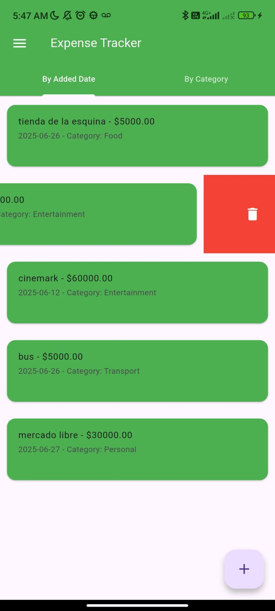

# Administrador de gastos (Flutter)

Una aplicación de gestión de gastos desarrollada en Flutter como proyecto de práctica. Esta app permite a los usuarios registrar, ver, filtrar y eliminar gastos, así como organizarlos por categorías y etiquetas. Además, incluye persistencia local de datos para que los gastos no se pierdan al cerrar la app.

## Características

- Lista completa de gastos registrados.
- Agregar un nuevo gasto con:
  - Nombre del beneficiario (Payee)
  - Monto
  - Notas
  - Fecha
  - Categoría
  - Etiquetas
- Almacenamiento local de gastos (persistencia).
- Agrupación de gastos por categoría.
- Eliminación de gastos.
- Gestión de categorías y etiquetas desde los ajustes.

## Historias de Usuario

- *"Quiero ver una lista de todos mis gastos para visualizar rápidamente mi historial de gastos."*
- *"Quiero agregar un gasto con un beneficiario, monto, notas, fecha, categoría y etiqueta para llevar un control detallado."*
- *"Quiero guardar mis gastos localmente para no perderlos al cerrar y volver a abrir la app."*
- *"Quiero agrupar mis gastos por categoría para entender en qué áreas gasto más."*
- *"Quiero eliminar un gasto para corregir errores o eliminar entradas innecesarias."*
- *"Quiero gestionar categorías y etiquetas desde la configuración de la aplicación."*

### Home 

### Agregando gasto

### Eliminando gasto

### Listado de gastos por categoria

### Tab bar

La paleta de colores no es lo mío...